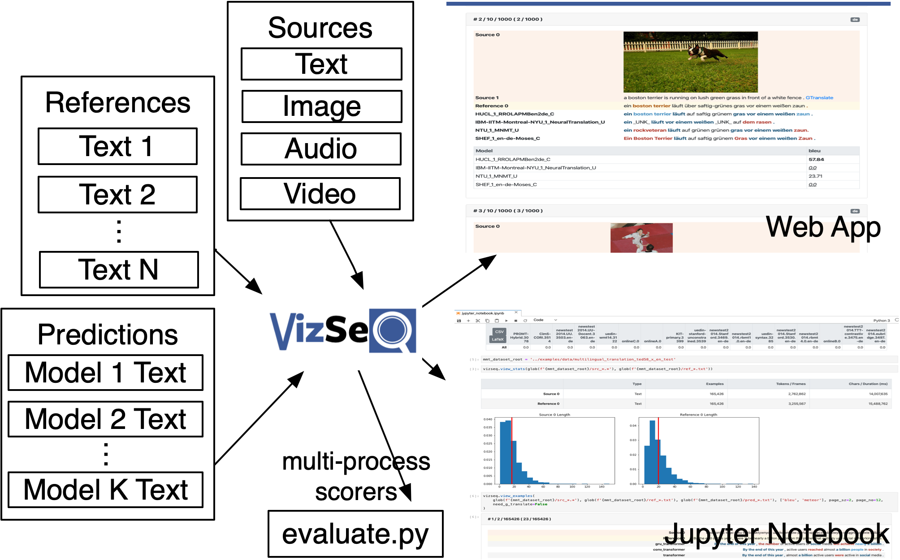

[](https://pypi.org/project/vizseq/)
[](https://circleci.com/gh/facebookresearch/vizseq)


# 
[VizSeq: A Visual Analysis Toolkit for Text Generation Tasks.](https://arxiv.org/pdf/1909.05424.pdf)

[[Documentation]](https://facebookresearch.github.io/vizseq)

## Overview

<p align="center">

</p>

### Task Coverage

| Source | Example Tasks |
| :--- | :--- |
| Text | Machine translation, text summarization, dialog generation, grammatical error correction, open-domain question answering |
| Image | Image captioning, image question answering, optical character recognition                                                |
| Audio | Speech recognition, speech translation                                                                                   |
| Video | Video description                                                                                                        |
| Multimodal | Multimodal machine translation

### Metric Coverage
**Accelerated with multi-processing/multi-threading.**

| Type | Metrics |
| :--- | :--- |
| N-gram-based | BLEU ([Papineni et al., 2002](https://www.aclweb.org/anthology/P02-1040)), NIST ([Doddington, 2002](http://www.mt-archive.info/HLT-2002-Doddington.pdf)), METEOR ([Banerjee et al., 2005](https://www.aclweb.org/anthology/W05-0909)), TER ([Snover et al., 2006](http://mt-archive.info/AMTA-2006-Snover.pdf)), RIBES ([Isozaki et al., 2010](https://www.aclweb.org/anthology/D10-1092)), chrF ([Popović et al., 2015](https://www.aclweb.org/anthology/W15-3049)), GLEU ([Wu et al., 2016](https://arxiv.org/pdf/1609.08144.pdf)), ROUGE ([Lin, 2004](https://www.aclweb.org/anthology/W04-1013)), CIDEr ([Vedantam et al., 2015](https://www.cv-foundation.org/openaccess/content_cvpr_2015/papers/Vedantam_CIDEr_Consensus-Based_Image_2015_CVPR_paper.pdf)), WER |
| Embedding-based | LASER ([Artetxe and Schwenk, 2018](https://arxiv.org/pdf/1812.10464.pdf)), BERTScore ([Zhang et al., 2019](https://arxiv.org/pdf/1904.09675.pdf)) |


## Installation
VizSeq requires **Python 3.6+** and currently runs on **Unix/Linux** and **macOS/OS X**. It will support **Windows** as well in the future.

You can install VizSeq from PyPI repository:
```bash
$ pip install vizseq
```

Or install it from source:
```bash
$ git clone https://github.com/facebookresearch/vizseq
$ cd vizseq
$ pip install -e .
```

## Getting Started
[[Full documentation]](https://facebookresearch.github.io/vizseq)

### Jupyter Notebook Examples
- [Multimodal Machine Translation](examples/multimodal_machine_translation.ipynb)
- [Multilingual Machine Translation](examples/multilingual_machine_translation.ipynb)
- [Speech Translation](examples/speech_translation.ipynb)
- [fairseq integration](examples/fairseq_integration.ipynb)

### Web App Example
Download example data:
```bash
$ git clone https://github.com/facebookresearch/vizseq
$ cd vizseq
$ bash get_example_data.sh
```
Launch the web server:
```bash
$ python -m vizseq.server --port 9001 --data-root ./examples/data
```
And then, navigate to the following URL in your web browser:
```text
http://localhost:9001
```

## License
VizSeq is licensed under [MIT](https://github.com/facebookresearch/vizseq/blob/master/LICENSE). See the [LICENSE](https://github.com/facebookresearch/vizseq/blob/master/LICENSE) file for details.

## Citation
Please cite as
```
@inproceedings{wang2019vizseq,
  title = {VizSeq: A Visual Analysis Toolkit for Text Generation Tasks},
  author = {Changhan Wang, Anirudh Jain, Danlu Chen, Jiatao Gu},
  booktitle = {In Proceedings of the 2019 Conference on Empirical Methods in Natural Language Processing: System Demonstrations},
  year = {2019},
}
```

## Contact
Changhan Wang ([changhan@fb.com](mailto:changhan@fb.com)), Jiatao Gu ([jgu@fb.com](mailto:jgu@fb.com))
