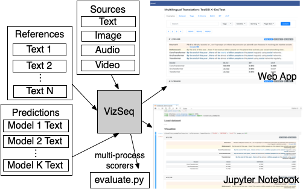

# 
A Visual Analysis Toolkit for Text Generation Tasks.

[EMNLP 2019 Paper](https://arxiv.org/abs/1909.05424)



 Supporting tasks with various source types:

| Source | Tasks |
| :--- | :--- |
| Text | Machine translation, text summarization, dialog generation, grammatical error correction, open-domain question answering |
| Image | Image captioning, image question answering, optical character recognition                                                |
| Audio | Speech recognition, speech translation                                                                                   |
| Video | Video description                                                                                                        |
| Multimodal | Multimodal machine translation

Built-in metrics:

| Type | Metrics |
| :--- | :--- |
| N-gram-based * | BLEU ([Papineni et al., 2002](https://www.aclweb.org/anthology/P02-1040)), NIST ([Doddington, 2002](http://www.mt-archive.info/HLT-2002-Doddington.pdf)), METEOR ([Banerjee et al., 2005](https://www.aclweb.org/anthology/W05-0909)), TER ([Snover et al., 2006](http://mt-archive.info/AMTA-2006-Snover.pdf)), RIBES ([Isozaki et al., 2010](https://www.aclweb.org/anthology/D10-1092)), chrF ([Popović et al., 2015](https://www.aclweb.org/anthology/W15-3049)), GLEU ([Wu et al., 2016](https://arxiv.org/pdf/1609.08144.pdf)), ROUGE ([Lin, 2004](https://www.aclweb.org/anthology/W04-1013)), CIDEr ([Vedantam et al., 2015](https://www.cv-foundation.org/openaccess/content_cvpr_2015/papers/Vedantam_CIDEr_Consensus-Based_Image_2015_CVPR_paper.pdf)), WER |
| Embedding-based | LASER ([Artetxe and Schwenk, 2018](https://arxiv.org/pdf/1812.10464.pdf)), BERTScore ([Zhang et al., 2019](https://arxiv.org/pdf/1904.09675.pdf)) |

\* **with multi-process acceleration**

## Requirements and Installation
* Python >= 3.7
* PyTorch >= 1.2

To install VizSeq:
```bash
> pip install vizseq
```

Install from source
```bash
> pip install -e .
```

## Get Started
### Visualization in Jupyter Notebook
Example notebooks

### Web App UI
First, launch the web server
```bash
python -m vizseq.server
```

And then, open the following URL
```text
http://localhost:9001
```

## Download Example Data
```bash
> bash get_example_data.sh
```

## Documentation

## Adding New Metrics
First, add `new_metric.py` file to `vizseq/scorers`, and then register the scoring function: 

```python
from typing import Optional, Dict, List, Set

from vizseq.scorers import register_scorer, VizSeqScorer, VizSeqScore

@register_scorer('metric_id', 'Metric Name')
class METEORScorer(VizSeqScorer):
    def score(
            self, hypothesis: List[str], references: List[List[str]],
            tags: Optional[List[List[str]]] = None
    ) -> VizSeqScore:
        return VizSeqScore.make(
            corpus_score=99.9,
            sent_scores=[99.9, 99.9],
            group_scores={'long': 99.9, 'short': 99.9}
        )
``` 
Add the unit test and run:
```bash
python -m unittest tests.scorers.test_<metric>
```

## Data
VizSeq's data is organized by datasets in the folder structure as follows:
```bash
<data_root>/<task_or_dataset_name>/src_*.{txt,zip}
<data_root>/<task_or_dataset_name>/ref_*.txt
<data_root>/<task_or_dataset_name>/tag_*.txt
<data_root>/<task_or_dataset_name>/pred_*.txt
```
where `src_*.{txt,zip}`, `ref_*.txt`, `tag_*.txt` and `pred_*.txt` are for sources, references, tags (optional) and predictions, respectively.


## Citation
Please cite as
```
@inproceedings{wang2019vizseq,
  title = {VizSeq: A Visual Analysis Toolkit for Text Generation Tasks},
  author = {Changhan Wang, Anirudh Jain, Danlu Chen, Jiatao Gu},
  booktitle = {In Proceedings of the 2019 Conference on Empirical Methods in Natural Language Processing: System Demonstrations},
  year = {2019},
}
```

## Contact
Changhan Wang ([changhan@fb.com](mailto:changhan@fb.com)), Jiatao Gu ([jgu@fb.com](mailto:jgu@fb.com))
